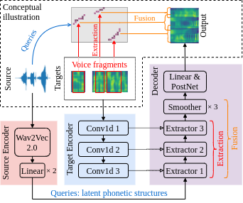
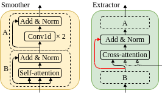

# FragmentVC-Japanese

This repository provides a voice conversion model based on the [FragmentVC](https://github.com/yistLin/FragmentVC/tree/main) architecture, but modified for Japanese (instead of English as the root repo). The model is designed to convert the voice of a source speaker to that of a target speaker while preserving linguistic content.
Voice conversion technology has various applications, such as in the entertainment industry for dubbing or character voice synthesis, in assistive technologies for individuals with speech impairments, and in virtual assistants or chatbots for generating natural-sounding speech.
The following are the overall model architecture and the conceptual illustration.



And the architecture of smoother blocks and extractor blocks.



## Dataset
[JVS (Japanese versatile speech) corpus](https://sites.google.com/site/shinnosuketakamichi/research-topics/jvs_corpus?authuser=0) - This corpus consists of Japanese text (transcripts) and multi-speaker voice data. The specification is as follows.

- 100 professional speakers
- Each speaker utters:
    - "parallel100" ... 100 reading-style utterances that are common among speakers
    - "nonpara30" ... 30 reading-style utterances that are completely different among speakers
    - "whisper10" ... 10 whispered utterances
    - "falsetto10" ... 10 falsetto utterances
- High-quality (studio recording),  high-sampling-rate (24 kHz), and large-sized (30 hours) audio files
- Useful tags included (e.g., gender, F0 range, speaker similarity, duration, and phoneme alignment (automatically generated))

However, I only use `parallel100` for the voice conversion task.

## Usage

You can download the pretrained model as well as the vocoder following the link [Fragment](https://drive.google.com/file/d/1P-LF_c4kYH_acwGzGFsK_wTffo4aEcp6/view?usp=sharing) and unzip into `FragmentVC-Japanese` folder path.

The whole project was developed using Python 3.8, torch 1.10.1, and the pretrained model as well as the vocoder were turned to [TorchScript](https://pytorch.org/docs/stable/jit.html), so it's not guaranteed to be backward compatible.
You can install the dependencies with

```bash
pip install -r requirements.txt
```

If you encounter any problems while installing *fairseq*, please refer to [pytorch/fairseq](https://github.com/pytorch/fairseq) for the installation instruction.

### Wav2Vec

In our implementation, we're using Wav2Vec 2.0 Base w/o finetuning which is trained on LibriSpeech.
You can download the checkpoint [wav2vec_small.pt](https://dl.fbaipublicfiles.com/fairseq/wav2vec/wav2vec_small.pt) from [pytorch/fairseq](https://github.com/pytorch/fairseq).

### Vocoder

The WaveRNN-based neural vocoder is from [yistLin/universal-vocoder](https://github.com/yistLin/universal-vocoder) which is based on the paper, [Towards achieving robust universal neural vocoding](https://arxiv.org/abs/1811.06292).

## Voice conversion with pretrained models

You can convert an utterance from source speaker with multiple utterances from target speaker, e.g.
```bash
python convert.py \
    -w <WAV2VEC_PATH> \
    -v <VOCODER_PATH> \
    -c <CHECKPOINT_PATH> \
    ./test/source/TRAVEL1000_0023.wav \ # source utterance
    ./test/target/female/FKN_SN_003.AD.wav \ # target utterance 1/3
    ./test/target/female/FKN_SN_004.AD.wav \ # target utterance 2/3
    ./test/target/female/FKN_SN_005.AD.wav \ # target utterance 3/3
    output.wav
```

Or you can prepare a conversion pairs information file in YAML format, like
```YAML
# pairs_info.yaml
pair1:
    source: ./test/source/TRAVEL1000_0023.wav
    target:
        - ./test/target/female/FKN_SN_004.AD.wav
pair2:
    source: ./test/source/TRAVEL1000_0023.wav
    target:
        - ./test/target/female/FKN_SN_003.AD.wav
        - ./test/target/female/FKN_SN_004.AD.wav
        - ./test/target/female/FKN_SN_005.AD.wav
        - ./test/target/female/FKN_SN_006.AD.wav
        - ./test/target/female/FKN_SN_007.AD.wav
        - ./test/target/female/FKN_SN_008.AD.wav
        - ./test/target/female/FKN_SN_009.AD.wav
```

And convert multiple pairs at the same time, e.g.
```bash
python convert_batch.py \
    -w <WAV2VEC_PATH> \
    -v <VOCODER_PATH> \
    -c <CHECKPOINT_PATH> \
    pairs_info.yaml \
    outputs # the output directory of conversion results
```

After the conversion, the output directory, `outputs`, will be containing
```text
pair1.wav
pair1.mel.png
pair1.attn.png
pair2.wav
pair2.mel.png
pair2.attn.png
```
where `*.wav` are the converted utterances, `*.mel.png` are the plotted mel-spectrograms of the formers, and `*.attn.png` are the attention map between *Conv1d 1* and *Extractor 3* (please refer to the model architecture above).

## Train from scratch

### Preprocessing

You can preprocess multiple corpora by passing multiple paths.
But each path should be the directory that directly contains the speaker directories,
i.e.
```bash
python preprocess.py \
    datasetVC/ \
    basic5000/ \
    <WAV2VEC_PATH> \
    features  # the output directory of preprocessed features
```

After preprocessing, the output directory will be containing:
```text
metadata.json
utterance-000x7gsj.tar
utterance-00wq7b0f.tar
utterance-01lpqlnr.tar
...
```

### Training

```bash
python train.py features --save_dir ./ckpts
```

You can further specify `--preload` for preloading all training data into RAM to boost training speed.
If `--comment <COMMENT>` is specified, e.g. `--comment jp`, the training logs will be placed under a newly created directory like, `logs/2020-02-02_12:34:56_jp`, otherwise there won't be any logging.
For more details, you can refer to the usage by `python train.py -h`.

## Demo 
To see demo using `gradio`, run:
```basg
python app.py
```
